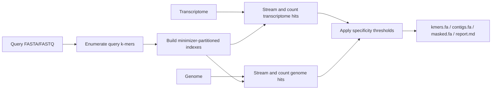

# KmeratoRS

Efficiently find specific k-mers from genes, transcripts, or local FASTA/FASTQ
queries.

## Install

You need Rust with Cargo.

You can install it directly:

```sh
cargo install --git https://github.com/Malfoy/Kmerators.git --locked --bin kmerators
```

Check the install:

```sh
kmerators --help
```

If `kmerators` is not found, add Cargo's binary directory to your `PATH`:

```sh
export PATH="$HOME/.cargo/bin:$PATH"
```

To run the examples or work on the code, clone the repository:

```sh
git clone https://github.com/Malfoy/Kmerators.git
cd Kmerators
cargo install --path . --locked --bin kmerators
```

## Run The Tiny Example

The tiny example is included in the repository, so run it from a clone:

```sh
cd Kmerators
bash examples/tiny/run.sh
```

If you installed directly with `cargo install --git`, clone the repository first
to get the example files.

The command should end with:

```text
Tiny example passed.
```

The tiny example is fully offline. It builds the tool, runs it on checked-in
FASTA files, and verifies `kmers.fa`, `contigs.fa`, and `masked.fa` against
expected outputs.

## What Files Do I Need?

For local FASTA/FASTQ mode, provide:

- `queries.fa`: sequences to extract specific k-mers from
- `transcriptome.fa`: transcriptome sequences used to reject non-specific k-mers
- `genome.fa`: reference genome sequences used to reject repeated k-mers

Any of these can be plain text or compressed as `.gz`, `.zst`, or `.xz`.

## Use Your Own FASTA/FASTQ

```sh
kmerators \
  -f queries.fa \
  --transcriptome-fasta transcriptome.fa.gz \
  -g genome.fa.gz \
  -S my_species \
  -r 1 \
  -k 31 \
  -o output \
  -t 16 \
  -y
```

The `-r 1` value keeps this local-file command offline. If `-r` is omitted, the
default release is `last`, which asks Ensembl for the current release.

FASTA/FASTQ inputs can be plain text or compressed as `.gz`, `.zst`, or `.xz`.

Results are written to `output/`:

- `kmers.fa`: retained specific k-mers
- `contigs.fa`: adjacent retained k-mers merged into contigs
- `masked.fa`: rejected query k-mers with genome/transcriptome counts
- `report.md`: run summary

Start by checking `output/report.md`; it lists completed, failed, ambiguous, and
warning cases for the run.

For FASTA/FASTQ queries, a k-mer is retained when its transcriptome count is
`<= --max-on-transcriptome` and its genome count is `<= --max-on-genome`.
Defaults are `0` and `1`.

## Use Several K-mer Sizes

Repeat `-k`:

```sh
kmerators \
  -f queries.fa \
  --transcriptome-fasta transcriptome.fa.gz \
  -g genome.fa.gz \
  -S my_species \
  -r 1 \
  -k 31 \
  -k 41 \
  -k 51 \
  -o output \
  -t 16 \
  -y
```

Outputs are written under one directory per size, for example `output/k31/`,
`output/k41/`, and `output/k51/`, with a combined `output/report.md`.

## Use Ensembl Genes Or Transcripts

Build a local Ensembl-backed dataset:

```sh
kmerators --mk-dataset -d data -S human -r last -y
```

This uses the network when `-r last` is used, and dataset creation can take time
because transcriptome and gene metadata are downloaded from Ensembl.

Find specific k-mers for gene symbols, Ensembl gene IDs, aliases, or transcript
IDs:

```sh
kmerators \
  -s NPM1 ENST00000255409 \
  -d data \
  -g GRCh38.fa.gz \
  -o output \
  -t 16 \
  -y
```

You can also pass one selection file to `-s`; whitespace-separated tokens are
read and text after `#` is treated as a comment.

## Requirements

- Rust toolchain with Cargo. If Rust is not installed yet, use the official
  [Rust installation guide](https://www.rust-lang.org/tools/install).
- A reference genome FASTA/FASTQ for extraction runs. Plain, `.gz`, `.zst`, and
  `.xz` inputs are accepted.
- Internet access only for Ensembl-backed commands that use `-r last`,
  `--mk-dataset`, `--update-dataset`, `--last-avail`, or `--info`.

## Build Without Installing

Portable optimized build:

```sh
cargo build --release --bin kmerators
```

The built binary is:

```sh
target/release/kmerators
```

Host-optimized build:

```sh
RUSTFLAGS="-C target-cpu=native" cargo build --release --no-default-features --bin kmerators
```

## Useful Options

```sh
kmerators ... \
  -k 31 \
  -m 9 \
  --hash-tables 1024 \
  --max-on-transcriptome 0 \
  --max-on-genome 1 \
  -t 16
```

- `-k, --kmer-length`: k-mer length; repeatable; default `31`
- `-m, --minimizer-length`: minimizer length; default `min(9, k)` for each k
- `--hash-tables`: minimizer-routed hash table count; default `1024`
- `-t, --thread`: worker thread count; default is available CPU count
- `--tmpdir`: temporary directory
- `--keep`: keep intermediate files where applicable
- `-D, --debug`: print extra run details

For gene mode, `--stringent` keeps only k-mers found in all isoforms. Without
`--stringent`, gene k-mers are retained when their transcriptome and isoform
presence counts are consistent and their genome count is at most one.

`--transcriptome-fasta` currently supports `--fasta-file` extraction only, not
gene/transcript selection.

## Tests

Run the full offline test suite:

```sh
cargo test --locked
```

Run the standalone toy smoke test:

```sh
bash examples/tiny/run.sh
```

Additional Python/Rust parity experiments live under `experiments/`. They are
useful for compatibility checks against the legacy Python implementation.

## Algorithm Overview

KmeratoRS starts from the query sequences instead of building a complete
reference k-mer database. It enumerates the query k-mers, partitions them by
minimizer, then streams the transcriptome and genome to count only the k-mers
that could match the query index.



For each requested k-mer length, the query k-mers are represented as exact
two-bit `u64` keys when `k <= 31`. Larger k values use fixed-size hashes. The
minimizer partition gives each k-mer a small lookup target, so reference scans
can skip work when a sequence block has no active minimizer partition.

The same run can evaluate several `-k` values. Query sequences and datasets are
loaded once, while transcriptome and genome scans update all requested indexes
for that counting phase. Retained k-mers are then merged into contigs, rejected
k-mers are written with their counts, and `report.md` summarizes the outcome.
